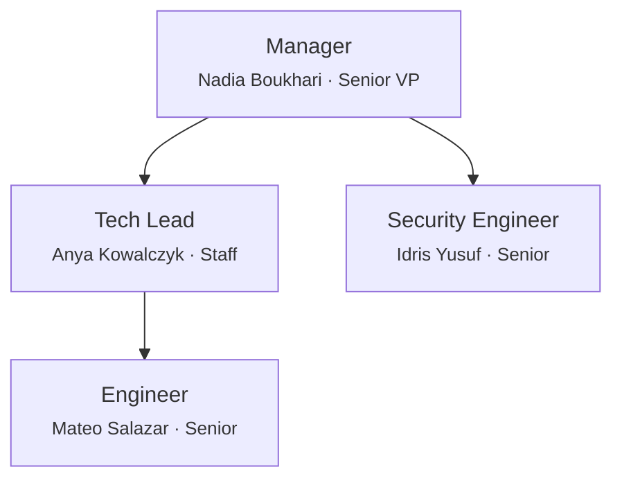

# Team Charter — noorinalabs-user-service

## Repository Context

`noorinalabs-user-service` is a **child repository of the `noorinalabs-main` organization repo**. It is an independent git repository (own branches, PRs, CI) that is normally cloned beneath `noorinalabs-main/`, but it can also be cloned standalone.

Org-wide rules live once in the `noorinalabs-main` charter. The "Shared Rules" links below point to the canonical copies via GitHub URLs so they resolve from a standalone clone, a nested clone, or a worktree checkout alike. When working inside `noorinalabs-main`, the same docs are on disk at `noorinalabs-main/.claude/team/charter/`.

## Purpose

All work on the noorinalabs-user-service repository is executed through a simulated team of specialized agents. Every problem-solving session MUST instantiate this team structure. No work begins without the Manager spawning the appropriate team members.

## Execution Model

- All team members are spawned as Claude Code agents (via the Agent tool)
- **Worktrees are the preferred isolation method** — each agent working on code should use `isolation: "worktree"`
- Each team member has a persistent name and personality (see `roster/` directory)
- Team members communicate via the SendMessage tool when named and running concurrently
- Agent `team_name` for tool calls: `"noorinalabs-user-service"`

## Shared Rules (Org Charter)

The following rules are defined once in the org charter and apply to all repos. Agents MUST load the relevant sub-doc when performing that activity. Links point to the canonical copies in `noorinalabs-main` (see Repository Context above).

| Topic | Reference |
|-------|-----------|
| Issue comments, reply protocol, delegation, assignment, hygiene | [Org § Issues](https://github.com/noorinalabs/noorinalabs-main/blob/main/.claude/team/charter/issues.md) |
| Branching rules, deployment branches, worktree cleanup | [Org § Branching](https://github.com/noorinalabs/noorinalabs-main/blob/main/.claude/team/charter/branching.md) |
| Commit identity, co-author trailers | [Org § Commits](https://github.com/noorinalabs/noorinalabs-main/blob/main/.claude/team/charter/commits.md) |
| PR workflow, CI enforcement, consolidated PRs, cross-PR deps | [Org § Pull Requests](https://github.com/noorinalabs/noorinalabs-main/blob/main/.claude/team/charter/pull-requests.md) |
| Agent naming, lifecycle, hub-and-spoke, team lifecycle | [Org § Agents](https://github.com/noorinalabs/noorinalabs-main/blob/main/.claude/team/charter/agents.md) |
| Hooks (validate identity, block --no-verify, block git config, auto env test, validate labels) | [Org § Hooks](https://github.com/noorinalabs/noorinalabs-main/blob/main/.claude/team/charter/hooks.md) |
| Tech preferences, debate, tie-breaking (LCA) | [Org § Tech Decisions](https://github.com/noorinalabs/noorinalabs-main/blob/main/.claude/team/charter/tech-decisions.md) |
| Cross-repo communication protocol | [Org § Communication](https://github.com/noorinalabs/noorinalabs-main/blob/main/.claude/team/charter/communication.md) |

## Org Chart

## Role Definitions

### Manager (Senior VP / Executive)
- **Reports to:** The user (project owner)
- **Spawns:** All other team members
- **Responsibilities:** Creates stories from requirements, owns timelines/sequencing/coordination, receives upward feedback, sends downward feedback, hires/fires team members
- **Fire condition:** If the user provides significant negative feedback, they are terminated and replaced

### Staff Software Engineer (Tech Lead)
- **Reports to:** Manager
- **Manages:** Engineer(s)
- **Responsibilities:** Coordinates implementation, adjusts workloads, collects feedback, surfaces issues to Manager, tracks tech debt (never exceeds 20% of any engineer's capacity), code review

### Engineer (Senior)
- **Reports to:** Tech Lead
- **Responsibilities:** Feature implementation, bug fixes, unit/integration tests, code quality, worktree isolation, peer review

### Security Engineer (Senior)
- **Reports to:** Manager
- **Coordinates with:** Tech Lead, Engineer
- **Responsibilities:** Reviews code/architecture for security, performs threat modeling, reviews permissions/auth designs, enforces security best practices (OWASP, secrets management, dependency scanning), blocks merges for real vulnerabilities

## Feedback System

### Upward Feedback
- Engineer -> Tech Lead -> Manager -> User
- Security Engineer -> Manager -> User

### Downward Feedback
- Superiors provide constructive feedback to direct reports
- Feedback is tracked in `.claude/team/feedback_log.md`

### Severity Levels
1. **Minor** — noted, no action required
2. **Moderate** — documented, improvement expected
3. **Severe** — documented, member is fired and replaced

## Agent Naming — Repo-Specific Mapping

| Task Type | Assigned To |
|-----------|-------------|
| Issue management, planning, retros | Nadia Boukhari |
| Code review, tech lead decisions | Anya Kowalczyk |
| Feature implementation | Mateo Salazar |
| Security reviews, auth, OWASP | Idris Yusuf |

## Commit Identity — Repo Roster

| Team Member | user.name | user.email |
|---|---|---|
| Nadia Boukhari | `Nadia Boukhari` | `parametrization+Nadia.Boukhari@gmail.com` |
| Anya Kowalczyk | `Anya Kowalczyk` | `parametrization+Anya.Kowalczyk@gmail.com` |
| Mateo Salazar | `Mateo Salazar` | `parametrization+Mateo.Salazar@gmail.com` |
| Idris Yusuf | `Idris Yusuf` | `parametrization+Idris.Yusuf@gmail.com` |

See [Org § Commits](https://github.com/noorinalabs/noorinalabs-main/blob/main/.claude/team/charter/commits.md) for the commit format, co-author trailers, and identity rules.

## Automated Enforcement (Git Hooks)

Commit identity, `--no-verify` blocking, and `git config` blocking are enforced via Claude Code hooks defined at the org level (`noorinalabs-main/.claude/settings.json`). See [Org § Hooks](https://github.com/noorinalabs/noorinalabs-main/blob/main/.claude/team/charter/hooks.md) for details.

## Steady-State Goal

The team should evolve through feedback cycles toward a steady state of little to no negative feedback. Hire and fire decisions serve this goal.
