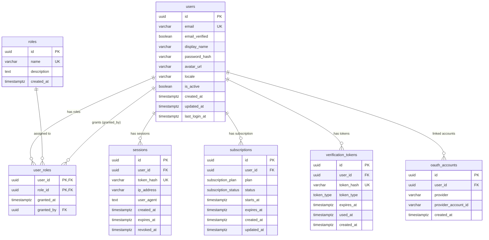

# User Service Database Schema

## Tables

### users
Core user identity table. Stores authentication credentials, profile info, and account state.
- UUID primary key with `gen_random_uuid()`
- `password_hash` is nullable to support OAuth-only users
- `email` has a unique index for login lookups
- Tracks `created_at`, `updated_at`, and `last_login_at`

### roles
Defines available authorization roles in the system.
- Seeded with four default roles: `admin`, `researcher`, `reader`, `trial`
- `name` is unique-indexed

### user_roles
Join table linking users to roles (many-to-many).
- Composite primary key `(user_id, role_id)`
- `granted_by` tracks which admin assigned the role (nullable, SET NULL on delete)
- CASCADE delete on both user and role FKs

### sessions
Active authentication sessions with token-based lookup.
- `token_hash` stores a hashed session token (unique index)
- `expires_at` indexed for efficient cleanup of expired sessions
- `revoked_at` nullable — set when session is explicitly revoked
- CASCADE delete when user is removed

### subscriptions
User subscription/plan tracking.
- `plan` enum: `free`, `trial`, `researcher`, `institutional`
- `status` enum: `active`, `expired`, `cancelled`, `suspended`
- CASCADE delete when user is removed

### verification_tokens
Short-lived tokens for email verification, password reset, and magic link login.
- `token_type` enum: `email_verification`, `password_reset`, `magic_link`
- `token_hash` unique-indexed for lookup
- Composite index on `(token_hash, expires_at)` for validated lookups
- `used_at` nullable — set when token is consumed
- CASCADE delete when user is removed

### oauth_accounts
Links external OAuth provider accounts to internal users.
- `provider` + `provider_account_id` has a unique composite index
- Supports Google, GitHub, Apple, Facebook
- CASCADE delete when user is removed

## ER Diagram

